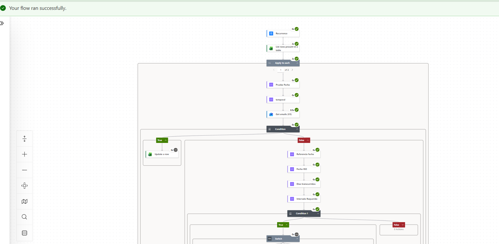

# Automated Follow-Up Email System

## 📌 Overview

Automated follow-up system developed with Microsoft Power Automate to manage and execute scheduled email follow-ups based on business rules and elapsed time.

The solution uses a structured data source to identify active records, determine when a follow-up is required, send the corresponding notification, and update the tracking information.

## 🎯 Business Problem

Manual follow-up processes can generate:

- Repetitive administrative tasks
- Missed follow-up dates
- Inconsistent tracking
- Lack of visibility over the follow-up history

The objective of this automation is to reduce manual work and establish a consistent follow-up process.

## 💡 Solution

The solution automates the follow-up process using Microsoft Power Automate.

The flow:

1. Retrieves active records.
2. Evaluates the follow-up status.
3. Calculates the elapsed time.
4. Determines whether a follow-up is due.
5. Sends the corresponding email.
6. Updates the follow-up information.
7. Maintains the tracking history.

## 🏗️ Architecture

```text
Data Source
     │
     ▼
Power Automate
     │
     ▼
Validate Active Records
     │
     ▼
Calculate Elapsed Time
     │
     ▼
Evaluate Business Rules
     │
     ▼
Follow-Up Required?
     │
 ┌───┴────┐
 │        │
Yes       No
 │        │
 ▼        ▼
Send      End
Email
 │
 ▼
Update Record

## 📸 Evidence of Execution

The following screenshot shows a successful execution of the Power Automate workflow, including data retrieval, business-rule evaluation, conditional logic, routing, email actions, and record updates.


